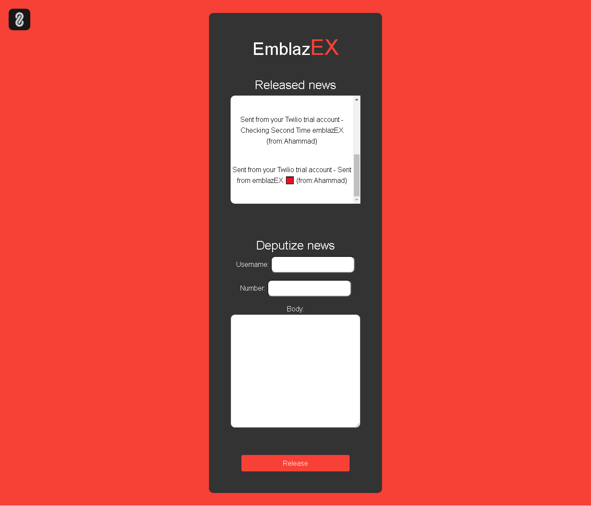

# emblazEX
A web-based micro tool for releasing moonly news on verified numbers 🟥

This is a quick fun project created with Django and Twilio API.

  

# How to use
- Verify your number in [Twilio](https://console.twilio.com/?frameUrl=/console/phone-numbers/verified)
- Go to the application [website](https://emblazex.herokuapp.com) 
- Send moonly news to your number

 

# License
Details can be found in [LICENSE](LICENSE)

 

# Interface

